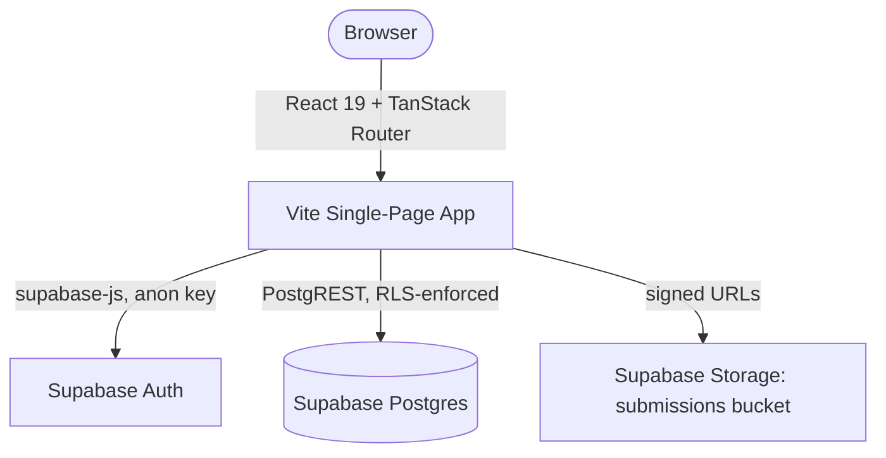
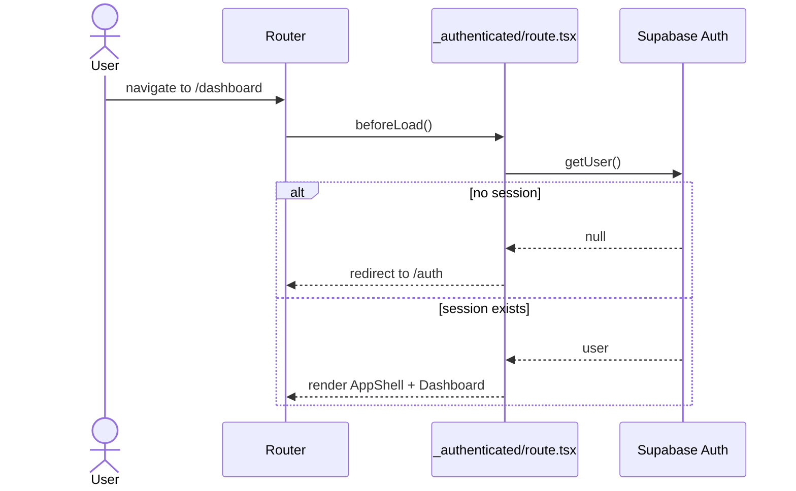
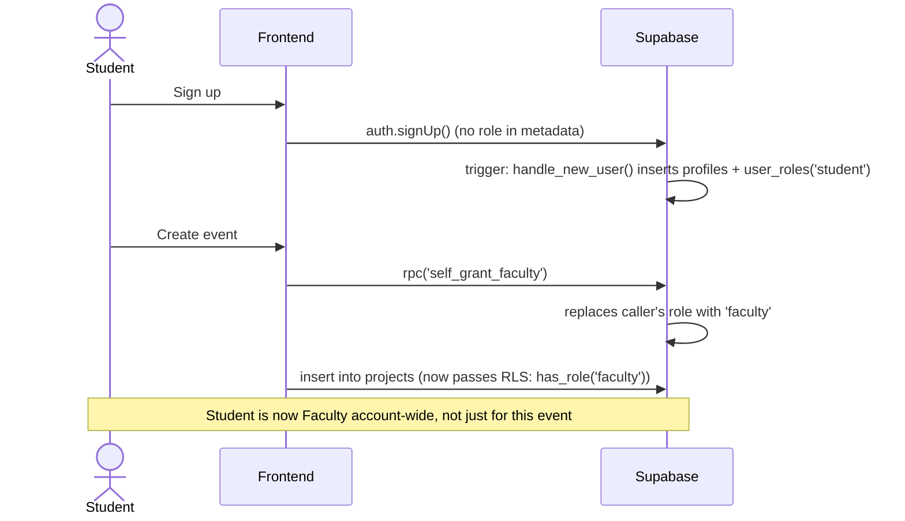
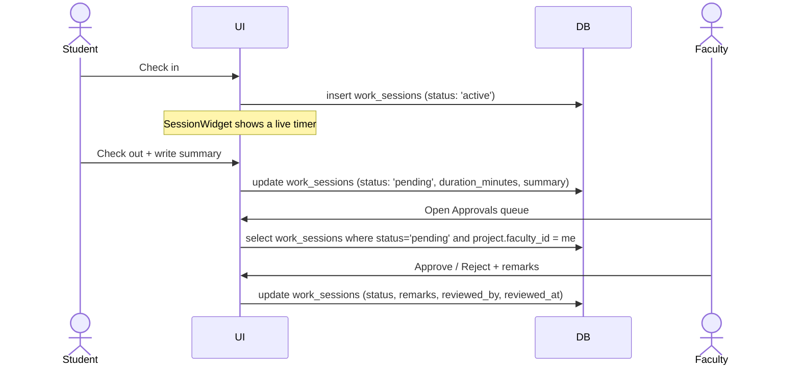
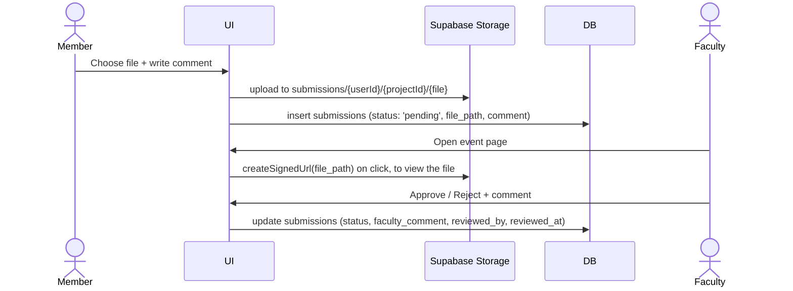

# Architecture — RAVS

How the frontend is put together and how data flows through it. For the database schema, RLS policies, and Supabase-specific setup, see [SUPABASE_GUIDE.md](SUPABASE_GUIDE.md).

---

## 1. High-level shape

There is no application server. The SPA talks to Supabase directly with the public anon key; every access rule is enforced by Postgres Row-Level Security, not by any backend code. This is a deliberate, load-bearing architectural choice — see §5 before adding a server component.

---

## 2. Routing & the auth guard

File-based routes under `src/routes/`, powered by `@tanstack/react-router`:

- `__root.tsx` — wraps everything in `QueryClientProvider` and `AuthProvider`. Renders `<Outlet />` directly; it does **not** render `<html>`/`<body>` (see §5 for why that matters).
- `index.tsx` — public landing page.
- `auth.tsx` — sign in / create account. Redirects to `/dashboard` if a session already exists.
- `_authenticated/route.tsx` — the guard. Its `beforeLoad` calls `supabase.auth.getUser()` and throws a redirect to `/auth` if there's no user; otherwise renders `AppShell` (header, nav, sign-out) around `<Outlet />`. Every route nested under `_authenticated/` inherits this guard automatically.

---

## 3. Role & auth flow

`lib/auth.tsx`'s `AuthProvider` loads the session once on mount and subscribes to `onAuthStateChange`. On each auth event it fetches the user's single `user_roles` row and their `profiles` row, self-healing either if missing (see [SUPABASE_GUIDE.md §3](SUPABASE_GUIDE.md#3-role-model) for the exact functions involved). `role` and `profile` are exposed via `useAuth()` and read throughout the app — there is no separate role fetch per page.

Promoting someone to `admin` (or changing anyone's role) is a separate, admin-only path: the members sidebar on an event page calls `rpc('admin_update_user_role', { target_user_id, new_role })`, which checks `has_role(auth.uid(), 'admin')` before doing anything.

---

## 4. Core feature flows

### Check-in / check-out (work sessions)

A partial unique index (`one_active_session_per_student`) guarantees a student can't have two active sessions at once — enforced in the database, not just the UI.

### File submissions

Both flows follow the same shape on purpose: member creates a `pending` row, the event's owning faculty (or an admin) transitions it to `approved`/`rejected` with their own remark. `lib/people.ts`'s `attachStudentNames()` is the shared helper that joins `student_name` / `student_role` onto whichever rows need it (sessions, submissions, or roster members).

---

## 5. Why this is a static SPA, not SSR — and a war story

`package.json` includes `@tanstack/react-start`, and `src/server.ts` / `src/start.ts` exist, left over from an earlier SSR-oriented setup. **None of it is active.** `vite.config.ts` only registers the plain `@tanstack/router-plugin` (no `tanstackStart()` plugin), and `netlify.toml` builds with `vite build` and deploys `dist/` as a static SPA with a catch-all redirect to `index.html`. `main.tsx` mounts the app the ordinary client-only way: `createRoot(document.getElementById("root")).render(...)`.

This matters because the two models are incompatible in one specific way: TanStack Start's SSR pattern has the root route's `shellComponent` render the entire `<html><head>...<body>...</body></html>` document, because in SSR the server *owns* the document. If you add a `shellComponent` to `__root.tsx` while still deploying as a static SPA, you get a second `<html>` document rendered *inside* `index.html`'s `
` — browsers can't nest `<html>` tags, so the browser's parser silently reparents the DOM, React's view of the tree stops matching reality, and the page hard-freezes on the very next re-render (which in practice meant: the moment a user typed a single character into the signup form). This exact bug shipped once and took a full debugging session to trace back to `shellComponent`. If you ever want real SSR, it needs the `tanstackStart()` Vite plugin, a real server entry point, and a hosting target that runs Node (not a static-file host like Netlify's SPA mode) — that's a deliberate migration, not a one-line addition to `__root.tsx`.

---

## 6. Further reading

- [README.md](../README.md) — setup, directory structure, tech stack.
- [SUPABASE_GUIDE.md](SUPABASE_GUIDE.md) — schema, RLS, security-definer functions, storage, migrations.
