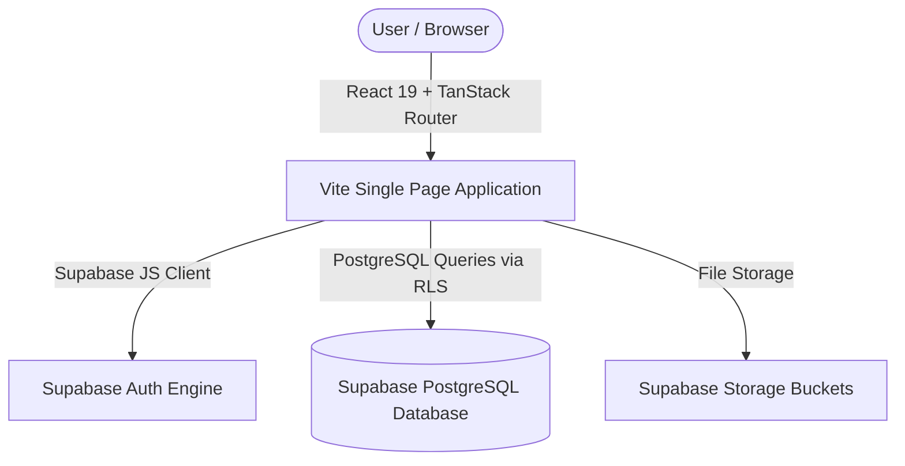
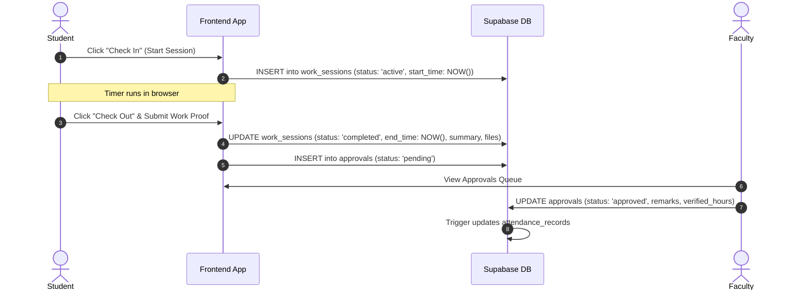

# Complete System Architecture & Developer Guide: Research Connect (RAVS)

This document provides a complete technical walkthrough of the **Research Attendance & Verification System (RAVS)**, detailing the frontend routing, state management, database schema, authentication flow, and deployment workflow.

---

## 1. Core Architecture & Stack



- **Frontend:** Built with **React 19**, **Vite**, **TanStack Router**, **TanStack Query**, and **Tailwind CSS v4**.
- **Backend Platform:** Serverless architecture backed entirely by **Supabase** (PostgreSQL, Supabase Auth, Storage).
- **Security Layer:** Enforced at the database level via PostgreSQL **Row-Level Security (RLS)** policies.

---

## 2. Directory Structure & Key Files

```text
src/
├── components/          # UI components (Radix primitives, Modals, Forms, Tables)
├── hooks/               # Custom React hooks (useAuth, useSessionTimer, useProjects)
├── lib/                 # Utility functions & Supabase JS client initializer
│   ├── supabase.ts      # Supabase client singleton instance
│   └── utils.ts         # Tailwind class merger (cn) & date formatters
├── routes/              # TanStack File-Based Route Hierarchy
│   ├── __root.tsx       # Root layout provider & global toast containers
│   ├── auth.tsx         # Sign in, sign up, and password reset form
│   └── _authenticated/  # Authenticated route guard layout
│       ├── dashboard.tsx        # Dynamic dashboard based on active role
│       ├── projects.index.tsx   # Project listing & filter views
│       ├── projects.$id.tsx     # Project detail, timer widget & submission form
│       ├── approvals.tsx        # Faculty approval queue with review dialogs
│       ├── attendance.tsx       # Attendance summary, charts & report generation
│       └── profile.tsx          # Account settings & password manager
```

---

## 3. Authentication & User Role Model

User authentication is managed via Supabase Auth. Profiles and permissions are linked to `auth.users(id)`:

```sql
CREATE TYPE public.app_role AS ENUM ('student', 'faculty', 'admin');

CREATE TABLE public.profiles (
    id UUID PRIMARY KEY REFERENCES auth.users(id) ON DELETE CASCADE,
    full_name TEXT NOT NULL DEFAULT '',
    college_id TEXT,
    department TEXT,
    phone TEXT,
    avatar_url TEXT,
    created_at TIMESTAMPTZ NOT NULL DEFAULT now(),
    updated_at TIMESTAMPTZ NOT NULL DEFAULT now()
);

CREATE TABLE public.user_roles (
    id UUID PRIMARY KEY DEFAULT gen_random_uuid(),
    user_id UUID NOT NULL REFERENCES auth.users(id) ON DELETE CASCADE,
    role public.app_role NOT NULL,
    created_at TIMESTAMPTZ NOT NULL DEFAULT now(),
    UNIQUE (user_id, role)
);

CREATE TABLE public.work_submissions (
    id UUID PRIMARY KEY DEFAULT gen_random_uuid(),
    project_id UUID NOT NULL REFERENCES public.projects(id) ON DELETE CASCADE,
    student_id UUID NOT NULL REFERENCES auth.users(id) ON DELETE CASCADE,
    title TEXT NOT NULL,
    description TEXT,
    file_path TEXT,
    file_name TEXT,
    file_size INTEGER,
    status public.session_status NOT NULL DEFAULT 'pending',
    remarks TEXT,
    reviewed_by UUID REFERENCES auth.users(id) ON DELETE SET NULL,
    reviewed_at TIMESTAMPTZ,
    created_at TIMESTAMPTZ NOT NULL DEFAULT now()
);
```

### Role Workflows

1. **Student:**
   - Starts active research timer on [projects.$id.tsx](file:///c:/Users/admin/Desktop/work/ravs/research-connect-main/src/routes/_authenticated/projects.$id.tsx).
   - Submits work notes and attached file proofs (PDFs, images, ZIPs) per event.
   - Views approved hours and attendance breakdown on [attendance.tsx](file:///c:/Users/admin/Desktop/work/ravs/research-connect-main/src/routes/_authenticated/attendance.tsx).

2. **Faculty:**
   - Inspects pending session and submission queue on [approvals.tsx](file:///c:/Users/admin/Desktop/work/ravs/research-connect-main/src/routes/_authenticated/approvals.tsx).
   - Reviews student work notes, downloads submitted documents, and approves/rejects with remarks.
   - Creates research events and manages event settings.

3. **Head Admin:**
   - Full visibility across events, rosters, and user permissions.
   - Updates user roles via secure `admin_update_user_role` and `self_grant_faculty` RPC functions (with automated duplicate role cleanup).

---

## 4. Work Session & Verification Workflow



---

## 5. Documentation Summary

The repository contains documentation covering all aspects of the application:

| Document                                                                                                                                     | Description                                                            |
| :------------------------------------------------------------------------------------------------------------------------------------------- | :--------------------------------------------------------------------- |
| 📘 **[README.md](file:///c:/Users/admin/Desktop/work/ravs/research-connect-main/README.md)**                                                 | Main project overview, features, quick start & role permissions.       |
| 🛡️ **[docs/SUPABASE_GUIDE.md](file:///c:/Users/admin/Desktop/work/ravs/research-connect-main/docs/SUPABASE_GUIDE.md)**                       | Full database schema, RLS policies, migrations & CLI tools.            |
| 🏗️ **[docs/PROJECT_ARCHITECTURE.md](file:///c:/Users/admin/Desktop/work/ravs/research-connect-main/docs/PROJECT_ARCHITECTURE.md)**           | Complete developer architecture, sequence diagrams & folder structure. |
